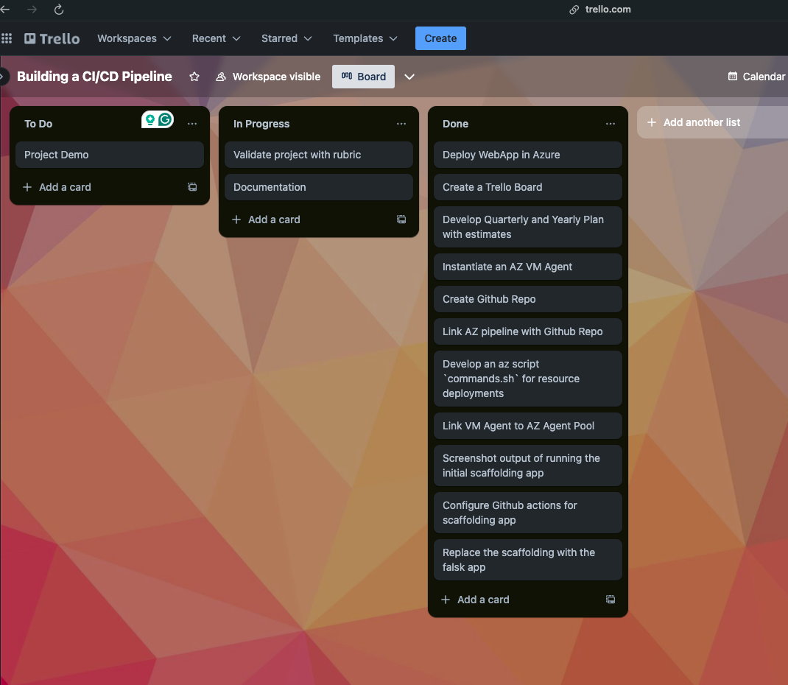
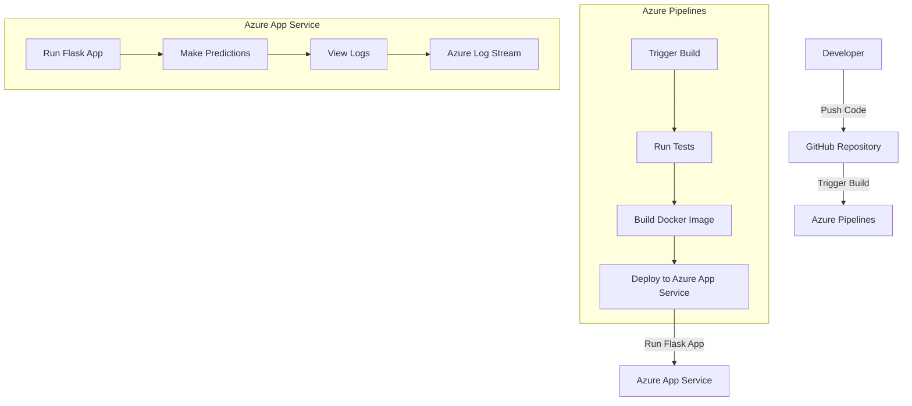
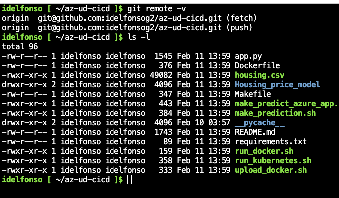
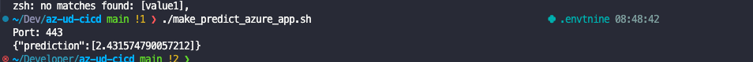

# Overview

[](https://github.com/idelfonsog2/az-ud-cicd/actions/workflows/python-app.yml)


This project involves building a CI/CD pipeline for a Python-based web application using Azure DevOps. The pipeline automates the processes of testing, building, and deploying the application to Azure App Service. The setup includes configuring the Azure Pipelines to run tests, build the Docker image, and deploy the application. The project also demonstrates how to clone the repository into Azure Cloud Shell, run tests using the `make all` command, and deploy the application using Azure Pipelines. Additionally, it includes steps to verify the deployment by making predictions using a Flask app and viewing the output of streamed log files from the deployed application.

## Project Plan

- [Trello Board](https://trello.com/invite/b/67ab66df8b534de2cfe3fdd9/ATTI1d97d485177741a8f0993e19ee9af8ee3956455D/building-a-ci-cd-pipeline)
- [Project plan - Spreadsheet Link](https://docs.google.com/spreadsheets/d/1RT4B3daL11LnMO6cjP72XUXhjDc83an7BQLOT6eeTCg/edit?usp=sharing)



## Instructions



## Instructions for Running the Python Project

To run this Python project, follow these steps:

1. **Clone the Repository**:
    Open Azure Cloud Shell and clone the repository using the following command:

    ```bash
    git clone https://github.com/your-repo/az-ud-cicd.git
    cd az-ud-cicd
    ```

    

2. **Setup Project**:
    Use the `make setup` command to install the required dependencies:

    ```bash
    make setup
    ```

3. **Run Tests**:
    Use the `make test` command to run tests and ensure everything is set up correctly:

    ```bash
    make test
    ```

    

4. **Deploy to Azure App Service**:
    run `make azure_webapp` to deploy the project to Azure App Service; notice that you need to have an Azure account and an active subscription to deploy the project,as well as the Azure CLI installed and configured.

    ```bash
    make azure_webapp
    ```

5. **Verify Deployment**:
    Modify the make_predict_azure_app.sh file to include the correct URL for the deployed application.
    Replace the `URL` variable with the URL of the deployed application:
    Verify the deployment by making predictions using the Flask app. Use the provided script:

    ```bash
    ./make_predict_azure_app.sh
    ```

    The output should look similar to this:

```bash
~/Dev/az-ud-cicd main !1 ❯ ./make_predict_azure_app.sh                                            .envtnine 08:48:42
Port: 443
{"prediction":[2.431574790057212]}
~/Developer/az-ud-cicd main !2 ❯   
```



6. **View Logs**:
    Check the output of streamed log files from the deployed application to ensure everything is running smoothly.

```log
2025-02-13T14:01:23.115720886Z 169.254.129.1 - - [13/Feb/2025:14:01:23 +0000] "GET / HTTP/1.1" 200 32 "-" "AlwaysOn"
2025-02-13T14:02:38.596412218Z /tmp/8dd4b778ed2e8ea/antenv/lib/python3.10/site-packages/sklearn/base.py:376: InconsistentVersionWarning: Trying to unpickle estimator LinearRegression from version 1.1.3 when using version 1.5.1. This might lead to breaking code or invalid results. Use at your own risk. For more info please refer to:
2025-02-13T14:02:38.596446302Z https://scikit-learn.org/stable/model_persistence.html#security-maintainability-limitations
2025-02-13T14:02:38.596454126Z   warnings.warn(
2025-02-13T14:02:38.596473833Z [2025-02-13 14:02:38,595] INFO in app: JSON payload: %s json_payload
2025-02-13T14:02:38.604620244Z [2025-02-13 14:02:38,601] INFO in app: inference payload DataFrame: %s inference_payload
2025-02-13T14:02:38.604633358Z [2025-02-13 14:02:38,601] INFO in app: Scaling Payload: %s payload
2025-02-13T14:02:38.620342671Z 169.254.129.1 - - [13/Feb/2025:14:02:38 +0000] "POST /predict HTTP/1.1" 200 35 "-" "curl/8.7.1"/home/LogFiles/2025_02_13_pl0sdlwk000026_docker.log  (https://final-ml-flask.scm.azurewebsites.net/api/vfs/LogFiles/2025_02_13_pl0sdlwk000026_docker.log)
2025-02-13T05:45:23.309Z INFO  -/home/LogFiles/AppServiceAppLogs_Feature_Installer/startup_0.log  (https://final-ml-flask.scm.azurewebsites.net/api/vfs/LogFiles/AppServiceAppLogs_Feature_Installer/startup_0.log)
2025-02-12 15:01:55,228  [MainThread] [DEBUG] : Initialized AppServiceAppLogging
2025-02-12 15:01:58,798  [Thread-3 (] [DEBUG] : Waiting for the logs flag to be set
2025-02-12 15:05:54,972  [MainThread] [DEBUG] : Initializating AppServiceAppLogging
2025-02-12 15:05:54,974  [Thread-1 (] [DEBUG] : Did not find any previously bound socket
2025-02-12 15:05:54,974  [MainThread] [DEBUG] : Initialized AppServiceAppLogging
2025-02-12 15:05:58,389  [Thread-3 (] [DEBUG] : Waiting for the logs flag to be set
2025-02-12 15:12:57,261  [MainThread] [DEBUG] : Initializating AppServiceAppLogging
2025-02-12 15:12:57,263  [Thread-1 (] [DEBUG] : Did not find any previously bound socket
2025-02-12 15:12:57,263  [MainThread] [DEBUG] : Initialized AppServiceAppLogging
2025-02-12 15:13:01,087  [Thread-3 (] [DEBUG] : Waiting for the logs flag to be set/home/LogFiles/CodeProfiler/3b6bb1_debug.log  (https://final-ml-flask.scm.azurewebsites.net/api/vfs/LogFiles/CodeProfiler/3b6bb1_debug.log)[2025_02_12_15_13_01] [appsvc_profiler.installer] [INFO] Code Profiler Installer is starting up[2025_02_12_15_13_01] [appsvc_profiler.installer] [INFO] Cleaning up any existing status file which indicated signal handlers initialized status[2025_02_12_15_13_01] [appsvc_profiler.installer] [INFO] Attempting to delete the signal_handler status file for instance id 3b6bb1e5c37cce5875b943397ad7a990c10104db547afd972454fc57f6bdadf8[2025_02_12_15_13_01] [appsvc_profiler.installer] [INFO] successfully deleted the status file[2025_02_12_15_13_01] [appsvc_profiler.installer] [DEBUG] APPSETTING_WEBSITE_ENABLE_DEFAULT_CODE_PROFILER : None[2025_02_12_15_13_01] [appsvc_profiler.installer] [INFO] Attempting to install the default code profiler.[2025_02_12_15_13_01] [appsvc_profiler.installer] [DEBUG] viztracer would save traces to /tmp/3b6bb1_profiler_trace.json[2025_02_12_15_13_01] [appsvc_profiler.installer] [INFO] Successfully installed code profiler.[2025_02_12_15_13_01] [appsvc_profiler.installer] [INFO] Signal Handlers SIGUSR for needed code-profiler have been initialized for gunicorn process on instance 3b6bb1e5c37cce5875b943397ad7a990c10104db547afd972454fc57f6bdadf8[2025_02_12_15_13_01] [appsvc_profiler.installer] [DEBUG] Code Profiler Installer is exiting as installation is completedEnding Log Tail of existing logs ---Starting Live Log Stream ---
```

By following these steps, you should be able to run the Python project without any issues.

## Enhancements

In the future, the project can be improved by implementing the following enhancements:

1. **Automated Security Scanning**:
    Integrate security scanning tools like Snyk or Dependabot to automatically detect and fix vulnerabilities in dependencies.

2. **Performance Monitoring**:
    Add performance monitoring using Azure Application Insights to track the application's performance and identify bottlenecks.

3. **Continuous Deployment**:
    Implement a continuous deployment strategy to automatically deploy updates to the production environment after passing all tests.

4. **Infrastructure as Code**:
    Use tools like Terraform or Azure Resource Manager (ARM) templates to manage infrastructure as code, ensuring consistent and repeatable deployments.

5. **Enhanced Testing**:
    Expand the test suite to include integration tests, end-to-end tests, and load tests to ensure the application performs well under various conditions.

6. **Scalability**:
    Configure Azure App Service to automatically scale based on demand to handle increased traffic without manual intervention.

By incorporating these enhancements, the project will become more robust, secure, and scalable, ensuring a better overall experience for users and developers.

## Demo 

<TODO: Add link Screencast on YouTube>
