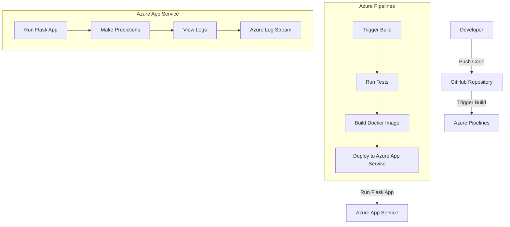

# Overview

This project involves building a CI/CD pipeline for a Python-based web application using Azure DevOps. The pipeline automates the processes of testing, building, and deploying the application to Azure App Service. The setup includes configuring the Azure Pipelines to run tests, build the Docker image, and deploy the application. The project also demonstrates how to clone the repository into Azure Cloud Shell, run tests using the `make all` command, and deploy the application using Azure Pipelines. Additionally, it includes steps to verify the deployment by making predictions using a Flask app and viewing the output of streamed log files from the deployed application.

## Project Plan

* A link to a Trello board for the project [here](https://trello.com/invite/b/67ab66df8b534de2cfe3fdd9/ATTI1d97d485177741a8f0993e19ee9af8ee3956455D/building-a-ci-cd-pipeline)
* A link to a spreadsheet that includes the original and final project plan

## Instructions



## Instructions for Running the Python Project

To run this Python project, follow these steps:

1. **Clone the Repository**:
    Open Azure Cloud Shell and clone the repository using the following command:

    ```bash
    git clone https://github.com/your-repo/az-ud-cicd.git
    cd az-ud-cicd
    ```

    

2. **Install Dependencies**:
    Ensure you have Python and pip installed. Then, install the required dependencies:

    ```bash
    pip install -r requirements.txt
    ```

3. **Run Tests**:
    Use the `make all` command to run tests and ensure everything is set up correctly:

    ```bash
    make all
    ```

    

4. **Build Docker Image**:
    Build the Docker image for the application:

    ```bash
    docker build -t your-image-name .
    ```

5. **Deploy to Azure App Service**:
    Follow the steps to deploy the application using Azure Pipelines. Refer to the official documentation for detailed instructions:
    [Azure DevOps Python WebApp CI/CD](https://docs.microsoft.com/en-us/azure/devops/pipelines/ecosystems/python-webapp?view=azure-devops).

6. **Verify Deployment**:
    Verify the deployment by making predictions using the Flask app. Use the provided script:

    ```bash
    ./make_predict_azure_app.sh
    ```

    The output should look similar to this:

    ```bash
    udacity@Azure:~$ ./make_predict_azure_app.sh
    Port: 443
    {"prediction":[20.35373177134412]}
    ```

7. **View Logs**:
    Check the output of streamed log files from the deployed application to ensure everything is running smoothly.

    

By following these steps, you should be able to run the Python project without any issues.

## Output

* Project running on Azure App Service

* 

* 

* Output of a test run

* Successful deploy of the project in Azure Pipelines.  [Note the official documentation should be referred to and double checked as you setup CI/CD](https://docs.microsoft.com/en-us/azure/devops/pipelines/ecosystems/python-webapp?view=azure-devops).

* Running Azure App Service from Azure Pipelines automatic deployment

* Successful prediction from deployed flask app in Azure Cloud Shell.  [Use this file as a template for the deployed prediction](https://github.com/udacity/nd082-Azure-Cloud-DevOps-Starter-Code/blob/master/C2-AgileDevelopmentwithAzure/project/starter_files/flask-sklearn/make_predict_azure_app.sh).
The output should look similar to this:

```bash
udacity@Azure:~$ ./make_predict_azure_app.sh
Port: 443
{"prediction":[20.35373177134412]}
```

* Output of streamed log files from deployed application

> <TODO: 

## Enhancements

In the future, the project can be improved by implementing the following enhancements:

1. **Automated Security Scanning**:
    Integrate security scanning tools like Snyk or Dependabot to automatically detect and fix vulnerabilities in dependencies.

2. **Performance Monitoring**:
    Add performance monitoring using Azure Application Insights to track the application's performance and identify bottlenecks.

3. **Continuous Deployment**:
    Implement a continuous deployment strategy to automatically deploy updates to the production environment after passing all tests.

4. **Infrastructure as Code**:
    Use tools like Terraform or Azure Resource Manager (ARM) templates to manage infrastructure as code, ensuring consistent and repeatable deployments.

5. **Enhanced Testing**:
    Expand the test suite to include integration tests, end-to-end tests, and load tests to ensure the application performs well under various conditions.

6. **Scalability**:
    Configure Azure App Service to automatically scale based on demand to handle increased traffic without manual intervention.

By incorporating these enhancements, the project will become more robust, secure, and scalable, ensuring a better overall experience for users and developers.

## Demo 

<TODO: Add link Screencast on YouTube>
